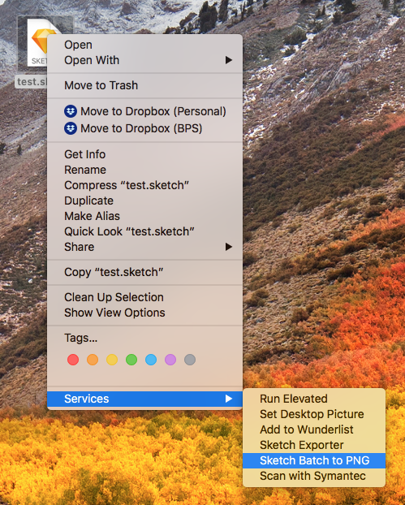

# sketch-batch-png

Use this tool to export entire pages of one or more sketch files into PNGs.
All pages will be exported, except any pages named Symbols. The page title will be used for the PNG filename, and will automatically override existing files with the same name. (If you have a "Page 1" in multiple sketch files, you will need to rename them to get multiple PNG exports.)

## To install

In Finder, go to `Go > Go to Folder…` and type in `~/Library/Services/`. Then copy the `Sketch Batch to PNG.workflow` file into that folder.

## To use

When you have one or more sketch file selected, right click and go into the Services menu to select Sketch Batch to PNG. Then choose a location to save the exported PNGs.

